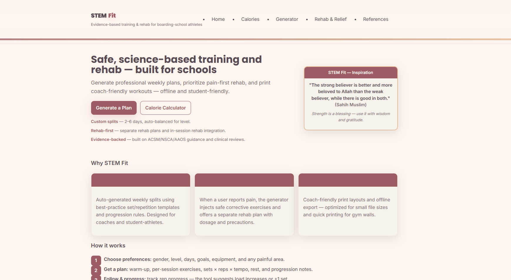
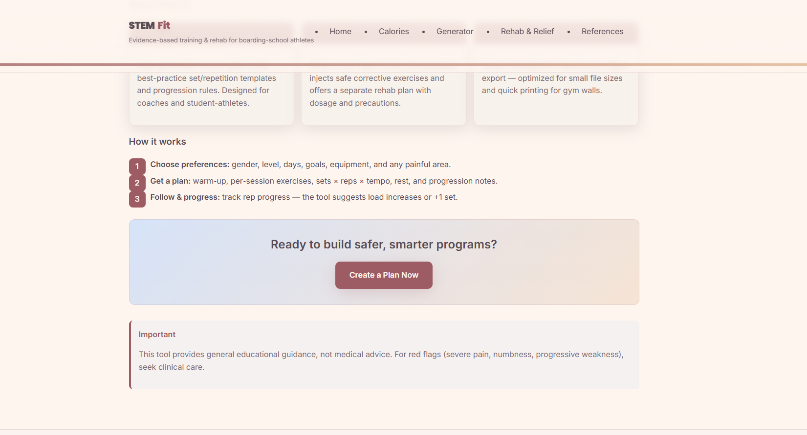
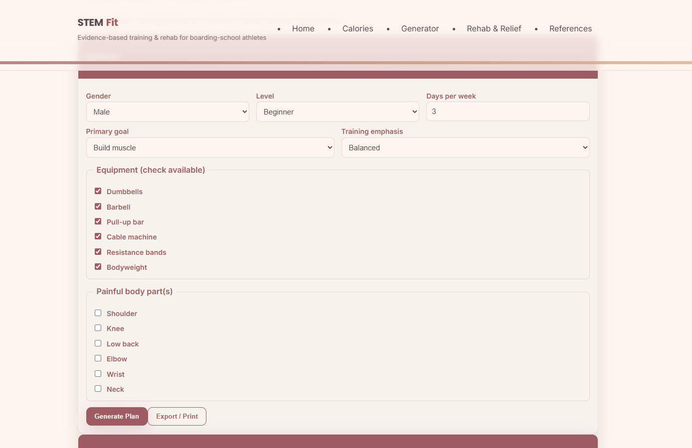
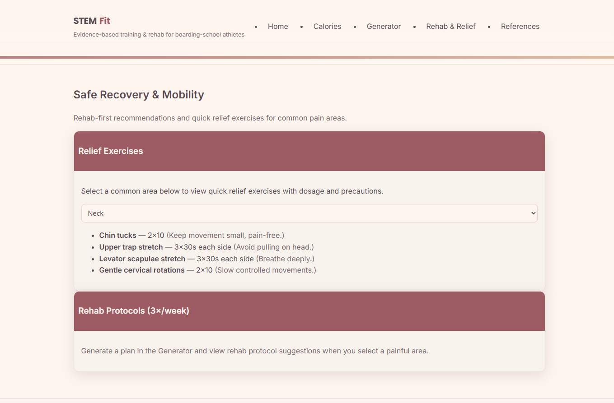
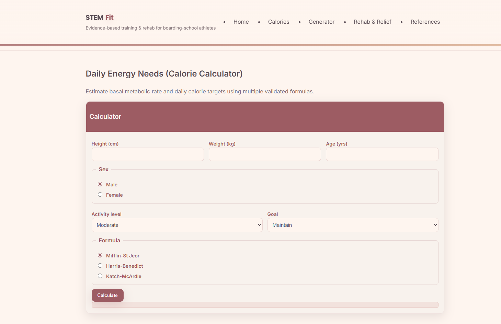

# STEMFit ⚡
**AI-Powered Fitness & Rehab Coach**

StemSplitz is an AI-powered training assistant that creates personalized, rehab-safe workout plans using ACSM/NSCA science. It features 136 exercises, each with tutorials and detailed specs like equipment, sets, reps, and rehab safety. Plans adapt to your goals, level, available equipment, and injuries, delivering evidence-based, safe, and efficient programming that most fitness apps overlook.

🔗 [Live Demo](https://youtu.be/fyB24kGy5YM)  
📊 [Pitch Deck (PDF)](public/pitch_deck.pdf/stemsplitzpitch.pdf)
---

## 📸 Screenshots

### 🏠 Landing Page

  
  

### ⚡ AI Generator & 🏥 Rehab Mode

  
  

### 🔢 Calorie Calculator

  

---

## 🚀 Key Features
- **126+ curated exercises** with biomechanical metadata (muscle groups, equipment, rehab-safe tags)  
- **AI-generated weekly training plans** (via Gemini 1.5 Flash) based on **filters like level, goals, injuries, and available equipment**  
- **Rehab integration** → auto-substitution of stress-heavy moves with joint-safe alternatives  
- **Calorie calculator** with 3 validated equations (Mifflin, Harris-Benedict, Katch-McArdle)  
- **Accessibility-first UI** (high-contrast mode, font scaling, keyboard navigation)  
- **Export/printable plans** for athletes, clinicians, or academic use  

---

## 🧠 Science & Methodology
- Training prescriptions follow **ACSM (American College of Sports Medicine)** and **NSCA (National Strength & Conditioning Association)** guidelines.  
- Progressive overload, volume/intensity targets, and injury modifications are evidence-driven.  
- All plans respect **user constraints** (equipment, pain sites, training emphasis).  
- JSON-based **exercise database** enables structured data queries for reproducible outputs.

---

## 🛠 Tech Stack
- **Frontend:** HTML5, CSS3, Vanilla JavaScript  
- **Backend:** Netlify Functions (serverless architecture)  
- **AI Engine:** Google Gemini 1.5 Flash API  
- **Database:** JSON (126+ structured exercise entries)  
- **Deployment:** Netlify (CI/CD, edge hosting)  

---

## 🎯 Why It’s Unique
Most fitness apps use either **generic templates** or **black-box AI suggestions**. StemSplitz is different:
1. **Evidence-Based:** grounded in sports science research.  
2. **Rehab-Aware:** avoids prescribing exercises that worsen pain, replacing them with safe alternatives.  
3. **Accessible & Lightweight:** no heavy backend; works on web instantly.  
4. **Scalable Applications:** suitable for **athletes, clinicians, and researchers** alike.  

---

## 💡 Future Business Potential
StemSplitz is more than a demo — it’s a scalable platform with real-world use cases:
- **B2C:** Subscription app for personalized training (fitness + injury prevention).  
- **B2B Licensing:**  
  - **Sports academies & clinics** → bulk licenses for athletes & patients.  
  - **Universities** → integration into exercise science curriculums & AI research labs.  
- **Data-as-a-Service:** anonymized training & rehab data for sports analytics or health research.  

---

## 🧾 How to Use
1. Select your **filters**: gender, level, days per week, goal, equipment, and pain points.  
2. Click **Generate Plan** → AI produces a **weekly program**.  
3. View plan, click any exercise for details/video, and export/print your training sheet. 

---

