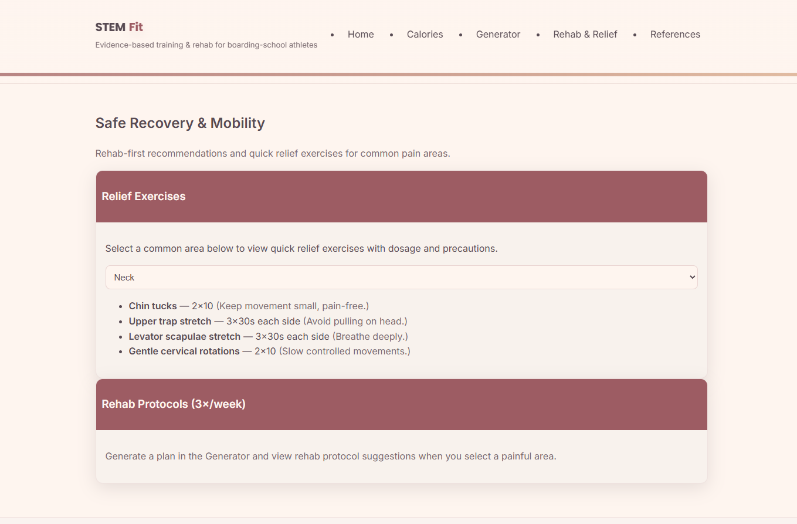
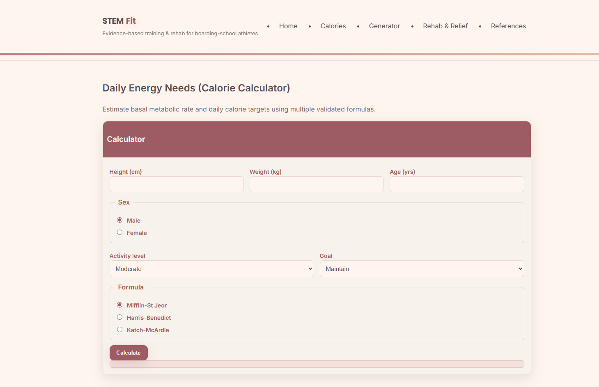

# StemSplitz ⚡
**AI-Powered Fitness & Rehab Coach**

StemSplitz is an intelligent training assistant that merges **exercise science (ACSM/NSCA standards)** with **generative AI** to create **personalized, rehab-safe training plans**.  
It bridges a critical gap: delivering **evidence-based programming** that adapts to individual goals, injuries, and equipment — something most fitness apps overlook.

🔗 [Live Demo](https://stemsplitzzz.netlify.app/)  
📊 [Pitch Deck (PDF)](public/pitch_deck.pdf/stemsplitzpitch.pdf)
---

## 📸 Screenshots

### 🏠 Landing Page

  
  

### ⚡ AI Generator & 🏥 Rehab Mode

  
  

### 🔢 Calorie Calculator

  

## 🚀 Key Features
- **126+ curated exercises** with biomechanical metadata (muscle groups, equipment, rehab-safe tags)  
- **AI-generated weekly training plans** (via Gemini 1.5 Flash) based on **filters like level, goals, injuries, and available equipment**  
- **Rehab integration** → auto-substitution of stress-heavy moves with joint-safe alternatives  
- **Calorie calculator** with 3 validated equations (Mifflin, Harris-Benedict, Katch-McArdle)  
- **Accessibility-first UI** (high-contrast mode, font scaling, keyboard navigation)  
- **Export/printable plans** for athletes, clinicians, or academic use  

---

## 🧠 Science & Methodology
- Training prescriptions follow **ACSM (American College of Sports Medicine)** and **NSCA (National Strength & Conditioning Association)** guidelines.  
- Progressive overload, volume/intensity targets, and injury modifications are evidence-driven.  
- All plans respect **user constraints** (equipment, pain sites, training emphasis).  
- JSON-based **exercise database** enables structured data queries for reproducible outputs.

---

## 🛠 Tech Stack
- **Frontend:** HTML5, CSS3, Vanilla JavaScript  
- **Backend:** Netlify Functions (serverless architecture)  
- **AI Engine:** Google Gemini 1.5 Flash API  
- **Database:** JSON (126+ structured exercise entries)  
- **Deployment:** Netlify (CI/CD, edge hosting)  

---

## 🎯 Why It’s Unique
Most fitness apps use either **generic templates** or **black-box AI suggestions**. StemSplitz is different:
1. **Evidence-Based:** grounded in sports science research.  
2. **Rehab-Aware:** avoids prescribing exercises that worsen pain, replacing them with safe alternatives.  
3. **Accessible & Lightweight:** no heavy backend; works on web instantly.  
4. **Scalable Applications:** suitable for **athletes, clinicians, and researchers** alike.  

---

## 💡 Future Business Potential
StemSplitz is more than a demo — it’s a scalable platform with real-world use cases:
- **B2C:** Subscription app for personalized training (fitness + injury prevention).  
- **B2B Licensing:**  
  - **Sports academies & clinics** → bulk licenses for athletes & patients.  
  - **Universities** → integration into exercise science curriculums & AI research labs.  
- **Data-as-a-Service:** anonymized training & rehab data for sports analytics or health research.  

---

## 🧾 How to Use
1. Select your **filters**: gender, level, days per week, goal, equipment, and pain points.  
2. Click **Generate Plan** → AI produces a **weekly program**.  
3. View plan, click any exercise for details/video, and export/print your training sheet. 

---

